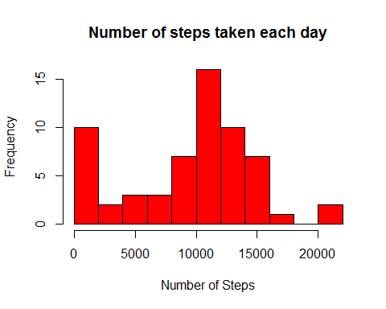
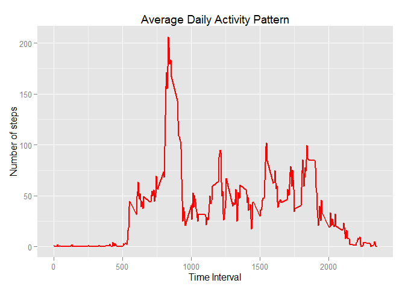
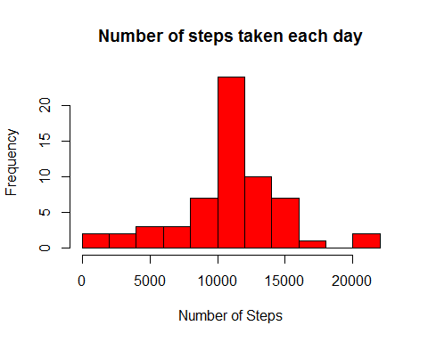
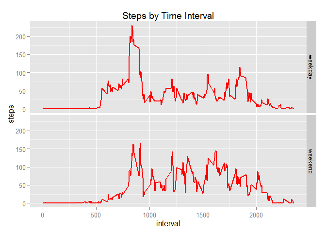

# Reproducible Research: Peer Assessment 1


## Loading and preprocessing the data
* unzip and read the data file (assuming it is in the working directory)
* convert dates to date format


```r
activity_data <- read.csv(unz("activity.zip","activity.csv"),stringsAsFactors = FALSE)
activity_data$date <- as.Date(activity_data$date, "%Y-%m-%d")
```
## What is mean total number of steps taken per day?

* Calculate total number of steps for each day (removing NA values)

```r
df <- aggregate(activity_data$steps, list(day = activity_data$date),sum, na.rm=TRUE)
names(df)[2] <- "steps"
```

*Plot Histogram


```r
hist(df$steps, breaks = 10, col = "red", xlab = "Number of Steps", ylab = "Frequency", main ="Number of steps taken each day")
```

 


* Mean number of steps per day:

```r
mean(df$steps)
```

```
## [1] 9354.23
```

* Median number of steps per day:

```r
median(df$steps)
```

```
## [1] 10395
```


## What is the average daily activity pattern?
* create a plot showing average daily activity pattern

```r
require(ggplot2)
```

```
## Loading required package: ggplot2
```

```r
df2 <- aggregate(activity_data$steps, list(interval = activity_data$interval),mean, na.rm=TRUE)
g <- ggplot(df2, aes(interval, x)) + geom_line(size = 1, color = "red") + ggtitle("Average Daily Activity Pattern")
print(g + labs(x="Time Interval", y = "Number of steps"))
```

 


* The time period with the maximum number of steps is:


```r
avg_stepsperinterval <- df2[order(-df2$x),]
avg_stepsperinterval[1,1]
```

```
## [1] 835
```

## Imputing missing values

* The total number of missing values is:

```r
sum(is.na(activity_data$steps))
```

```
## [1] 2304
```

* Create a new data set filling in missing values.

* The strategy used to fill in missing values is to use the mean number of steps for that interval.

```r
temp_merge <- merge(activity_data,avg_stepsperinterval)
temp_merge_na <- temp_merge[is.na(temp_merge$steps),]
temp_merge_notna <- temp_merge[is.na(temp_merge$steps) == FALSE,]

temp_merge_na$steps <- temp_merge_na$x
tempnewdata <- rbind(temp_merge_na,temp_merge_notna)
newdata <- tempnewdata[,1:3]
write.csv(newdata,"newdata717.csv")
```


* Calculate total number of steps for each day

```r
df4 <- aggregate(newdata$steps, list(day = newdata$date),sum, na.rm=TRUE)
names(df4)[2] <- "steps"
str(df4)
```

```
## 'data.frame':	61 obs. of  2 variables:
##  $ day  : Date, format: "2012-10-01" "2012-10-02" ...
##  $ steps: num  10766 126 11352 12116 13294 ...
```

* Plot Histogram


```r
hist(df4$steps, breaks = 10, col = "red", xlab = "Number of Steps", ylab = "Frequency", main ="Number of steps taken each day")
```

 


* Mean number of steps per day with imputed missing values:

```r
mean(df4$steps)
```

```
## [1] 10766.19
```

* Median number of steps per day with imputed missing values:

```r
median(df4$steps)
```

```
## [1] 10766.19
```

By filling in missing values for steps the mean number of steps has changed by


```r
mean(df4$steps) - mean(df$steps)
```

```
## [1] 1411.959
```

The median has changed by

```r
median(df4$steps) - median(df$steps)
```

```
## [1] 371.1887
```

## Are there differences in activity patterns between weekdays and weekends?

* Create factor variable to identify if date is weekend

```r
newdata$daytype[(substr(weekdays(newdata$date),1,1)=="S")] <- "weekend"
newdata$daytype[(substr(weekdays(newdata$date),1,1)!="S")] <- "weekday"
newdata$daytype <- as.factor(newdata$daytype)

df6 <- aggregate(newdata$steps,list(interval = newdata$interval,daytype = newdata$daytype),mean)
names(df6)[3] <- "steps"
```


* Make a panel plot showing activity across all days by time interval for weekends vs. weekdays


```r
g10 <- ggplot(df6, aes(interval,steps)) + geom_line(size = 1, color = "red") + ggtitle("Steps by Time Interval")
g11 <- g10 + facet_grid(daytype ~.)
print(g11)
```

 

